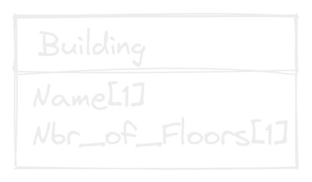
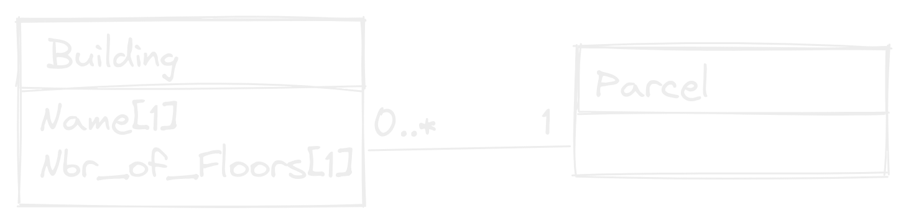
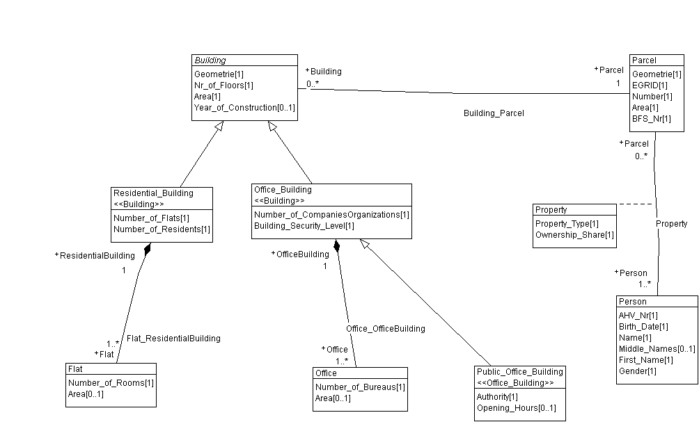
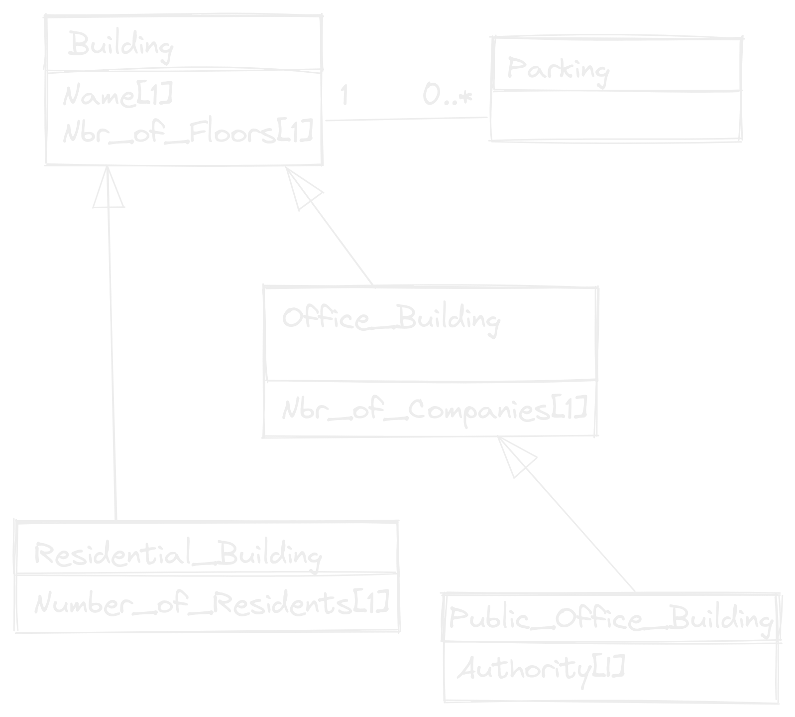
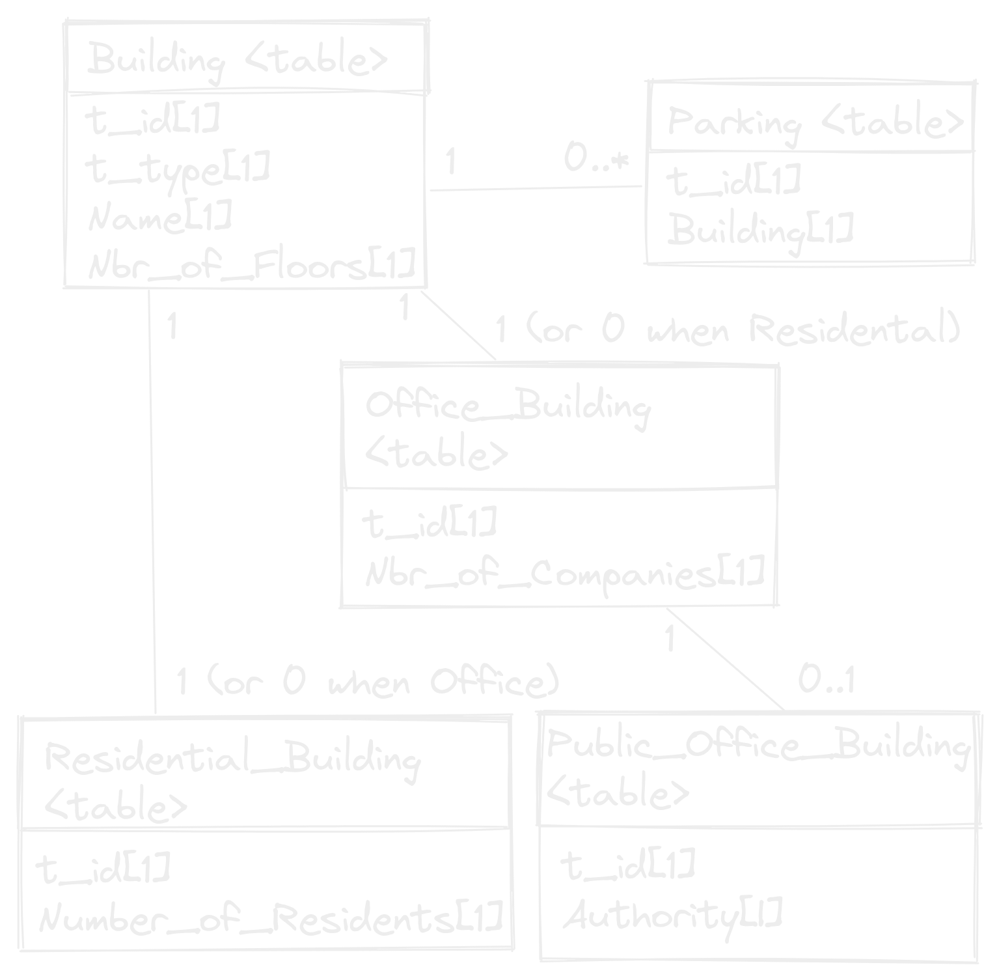
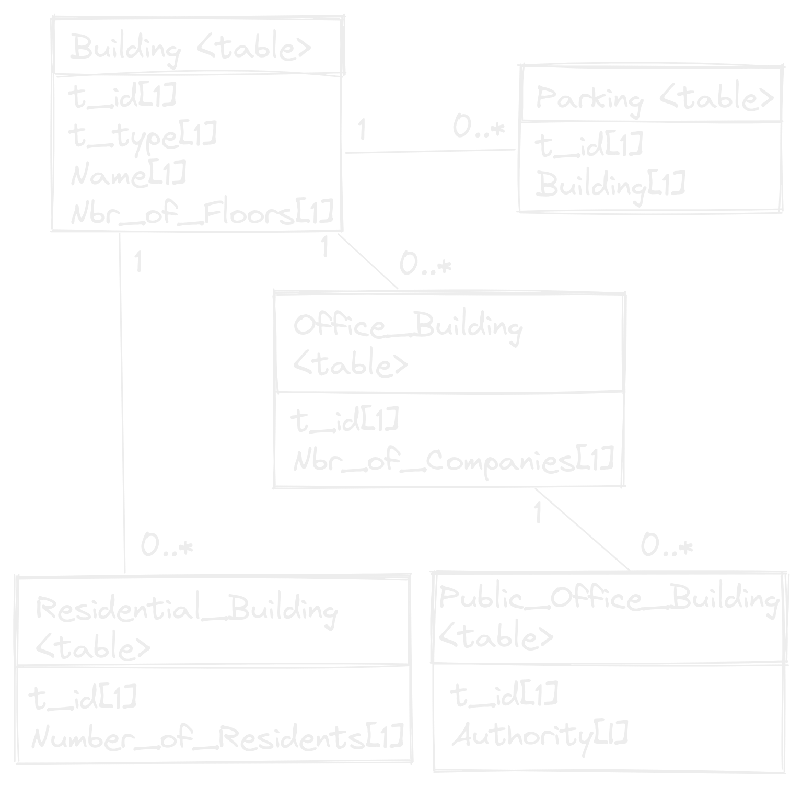
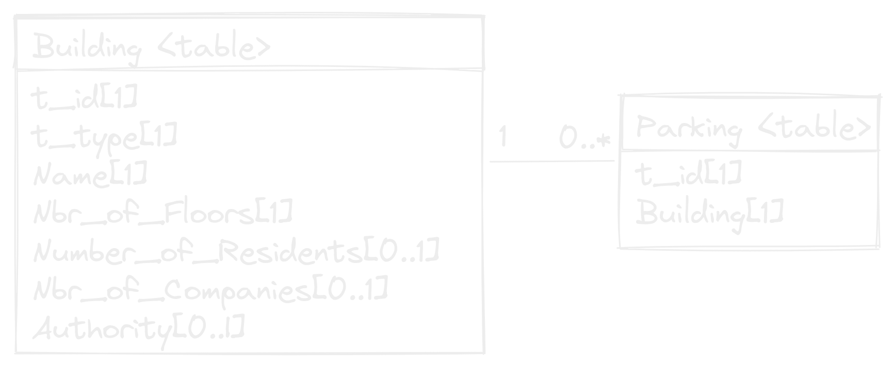
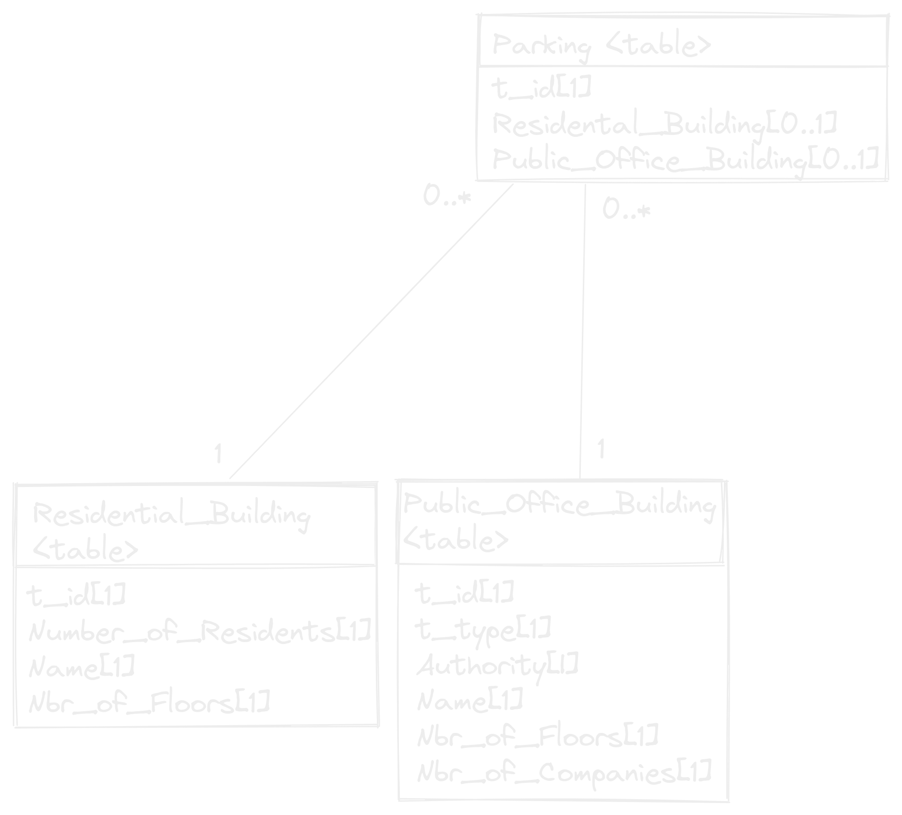
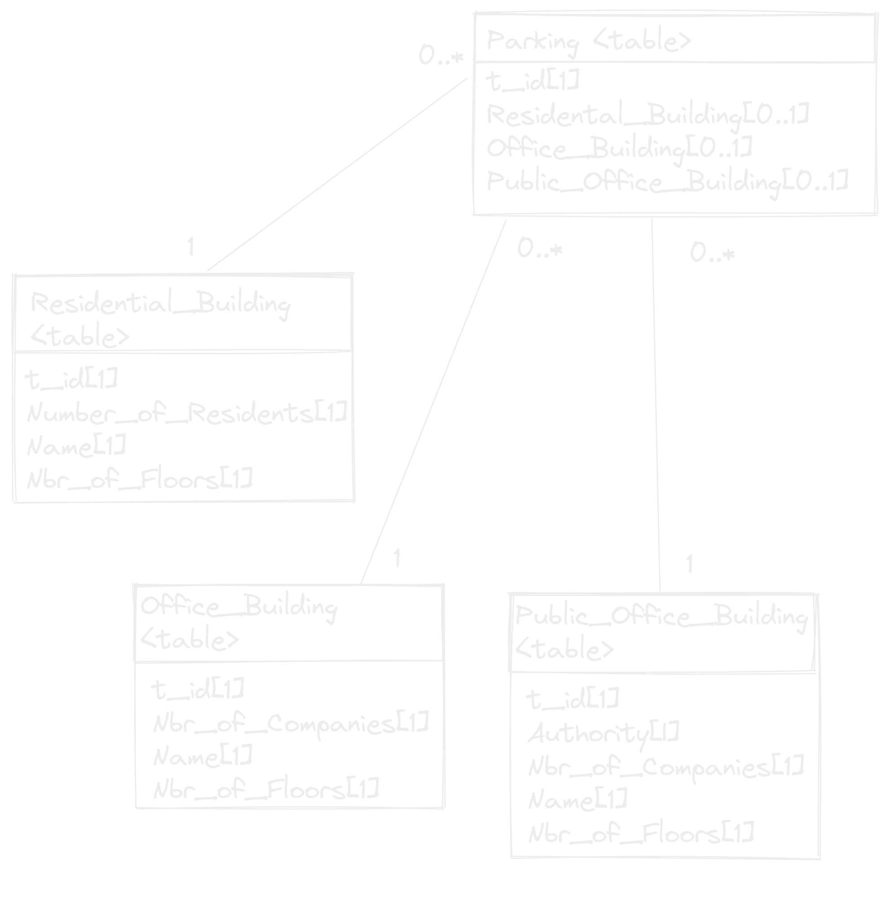

# <!--fit--> INTERLIS Relations in QGIS

How INTERLIS associations and inheritances are handled as QGIS relations

---

# Andreas Neumann
#### Kanton Solothurn
QGIS PSC Member
QGIS Power User
QGIS Model Baker Group
# David Signer
#### OPENGISch
Software Engineer
QGIS Core Comitter
QGIS Model Baker Coordinator


---

# Workshop
- INTERLIS Classes
- INTERLIS Associations
- Check the INTERLIS Model
- Inheritance in Physical Models
- Associations in QGIS
- Widgets for handling relations in QGIS

---

# INTERLIS Classes


---

## Classes
**Syntax**
```
ClassDef =  'CLASS' Class-Name '='
                { AttributeDef }
            'END' Class-Name ';'.
```
**Example**
```   
CLASS Building =
    Name : TEXT*20;
    Nr_of_Floors : MANDATORY 1 .. 100;
END Building;
```
---
## Structures
**Syntax**
```
StructureDef =  'STRUCTURE' Struct-Name '='
                    { AttributeDef }
                'END' Struct-Name ';'.
```
**Example**
```
STRUCTURE Address =
    StreetName : TEXT*40;
    Number : TEXT*12;
END Address;
```
---
## Types of classes
- Concrete
- Abstract
- Final
- Derivate/Extended
---
## Concrete Classes
```
CLASS Building =
    Name : TEXT*20;
    Nr_of_Floors : MANDATORY 1 .. 100;
END Building;

CLASS Office_Building
    EXTENDS Building =
    Nr_of_Companies : MANDATORY 1 .. 200;
END CLASS Office_Building;
```
---

## Abstract Classes
```
CLASS Building (ABSTRACT) =
    Name : TEXT*20;
    Nr_of_Floors : MANDATORY 1 .. 100;
END Building;

CLASS Office_Building
    EXTENDS Building =
    Nr_of_Companies : MANDATORY 1 .. 200;
END CLASS Office_Building;
```
---

## Final Classes
```
CLASS Building (FINAL) =
    Name : TEXT*20;
    Nr_of_Floors : MANDATORY 1 .. 100;
END Building;

CLASS Office_Building
    EXTENDS Building =
    Nr_of_Companies : MANDATORY 1 .. 200;
END CLASS Office_Building;
```
```
!! Error: Building cannot be extended
```
---
## Extending Structures
```
STRUCTURE AddressBase (ABSTRACT) =
    StreetName : TEXT*40;
    Number : TEXT*12;
END AddressBase;

CLASS Address
    EXTENDS AddressBase =
    PLZ : TEXT*6;
    Remarks : TEXT;
END CLASS Address;
```
---

# INTERLIS Associations


---

## Cardinality

### one-to-many
A building belongs to **exactly one** parcel. A parcel **can** have **multiple** buildings.

```
ASSOCIATION =
    local_buildings -- {0..*} Building;
    parcel -- {1} Parcel;
END;
```
### many-to-many
A parcel is owned by **at least one** person. A person **can** own parts of **multiple** parcels.

```
ASSOCIATION Property =
    Person -- {1..*} Person;
    Parcel -- {0..*} Parcel;
END;
```
---

## Strength
- Association `--`: Relationship between independent objects. 
- Aggregation `-<>`: Relationship between parts and a whole. A part can be part of multiple wholes.
- Composition `-<#>`: Relationship between parts and a whole. A part can only be part of a single whole.

<!-- **aggregation** all ascribed parts are automatically copied when copying the entity, however when
deleting the entity the corresponding parts **remain untouched**. Compared to an aggregation you will
find that a **composition** further implies, that when deleting the entity **all parts are deleted** at the
same time.-->
---

## Attributes
An association can contain attributes as well.
```
ASSOCIATION Property =
    Person -- {1..*} Person;
    Parcel -- {0..*} Parcel;
    Ownership_Share : 0 .. 100;
END;
```
---
## Structures

```
STRUCTURE Address =
    StreetName : TEXT*40;
    Number : TEXT*12;
END Address;

CLASS Building =
    Position : Address;
END Building;
```
Possible to use with `LIST` or `BAG .. OF`
```
CLASS Building =
    Position : BAG {0..*} OF Address;
END Building;
```
---

## Cross Topic Associations (1)
A topic that references a class from another topic must have a dependency on the other topic. In the association, one has to use the keyword "EXTERNAL".
```
  TOPIC Parcel =
    DEPENDS ON Building_Parcel_Property.Person;

    ASSOCIATION Property =
      Person (EXTERNAL) -- {1..*} Building_Parcel_Property.Person.Person;
      Parcel -- {0..*} Parcel;
      property_type : MANDATORY Building_Parcel_Property.Property_Type;
      ownership_share : MANDATORY 0 .. 100 [Units.Percent];
    END Property;
```

---
## Cross Topic Associations (2)
Cross topic associations in UML-Editor:


---

# Example Model [`Building_Parcel_Property`](./model/building_parcel_property.ili)



<!-- Go through the ili model -->
---

# The model in QGIS
- ili2db creates the physical Database
- QGIS Model Baker generates the project
- With UsabILIty Hub preconfigured Settings and Stylings can be received from the Repository
---

# Inheritance mapping
- New Class
- Super Class
- Sub Class
- New+Sub Class

---

## Sample Model



<!-- Mention that Parking is not Parcel -->

---
## New Class (1)



---
## New Class (2)
```
Building.t_type: (
    Residental_Building,
    Office_Building,
    Public_Office_Building
)
```
- Specializations are mapped as associations
- Multiple inserts and updates required per object
- Not null attributes can be setted



---

## Super Class
```
Building.t_type: (
    Residental_Building,
    Office_Building,
    Public_Office_Building
)
```
- Missing not null constraints
- Less tables and associations (easy to use)



---

## Sub Class
```
Public_Office_Building.t_type: (
    Office_Building,
    Public_Office_Building
)
```
- Missing not null constraints



---

## New + Sub Class
- IMO the expected behavior
- Missing not null constraints



---

# Smart Mapping in ili2db

---

## noSmartMapping

- All classes are mapped using *New Class* strategy

<!-- Maybe graphic how it looks like -->
---

## smart1Inheritance

- Abstract classes without associations -> *Sub Class* strategy
- Abstract classes with associations and no concrete super class -> *New Class* strategy
- Concrete classes without concrete super class -> *New Class* strategy
- All other classes -> *Super Class* strategy

Means in our example the `Building` uses *New Class* and all others *Super Class* strategy. This results in what we see in the *Super Class* graphic.

---

## smart2Inheritance
-  Abstract classes -> *Sub Class* strategy
-  All concrete classes  -> *New + Sub Class* strategy

Means in our example the `Building` uses *Sub Class* and all other *New+Sub Class*. This results in what we see in the *New+Sub Class* graphic.
---

# Relations in QGIS
